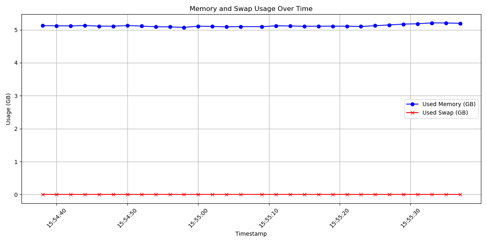

# Memory Usage Monitor

This project consists of two scripts: `monitor_memory.sh` and `visualize_memory.py`.

## Overview

- **`monitor_memory.sh`**: Monitors and logs memory usage over a specified period.
- **`visualize_memory.py`**: Visualizes the collected memory usage data.

## Monitoring Memory Usage

The `monitor_memory.sh` script is used to collect RAM usage data and save it to a log file. You can run the script with the following command:

```bash
./monitor_memory.sh -d <duration_in_seconds> -i <interval_in_seconds> -o <output_file>
```

## Visualizing Memory Usage

The visualize_memory.py script reads the log file generated by monitor_memory.sh and creates a plot of memory usage over time. Here is how the graph looks like:



